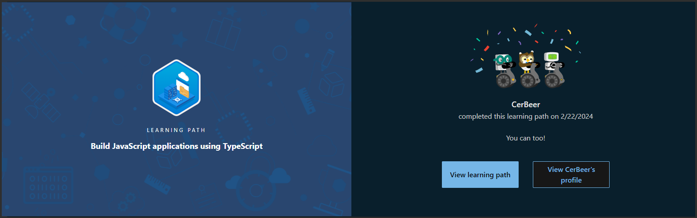
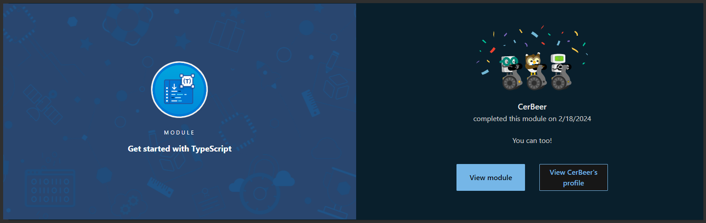
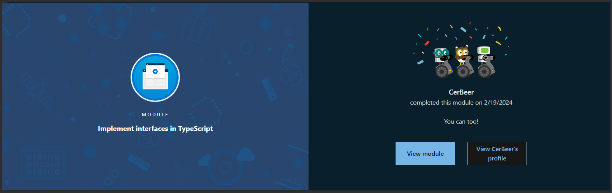
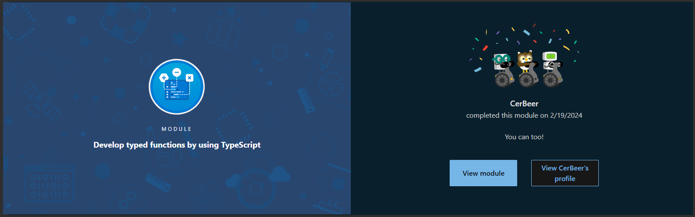
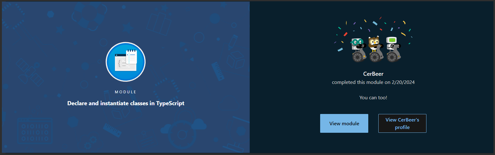
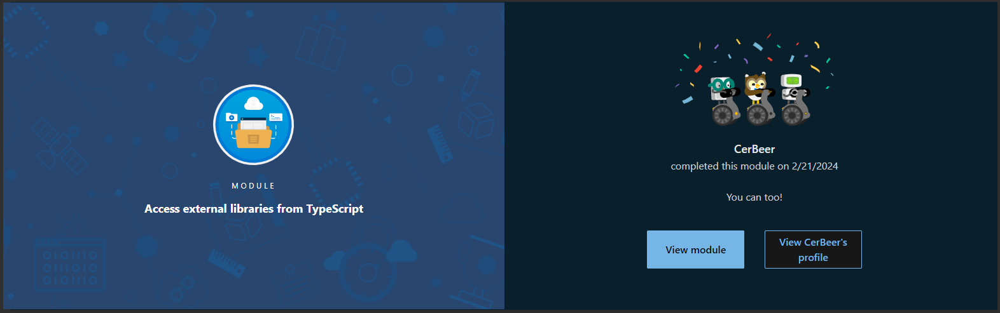
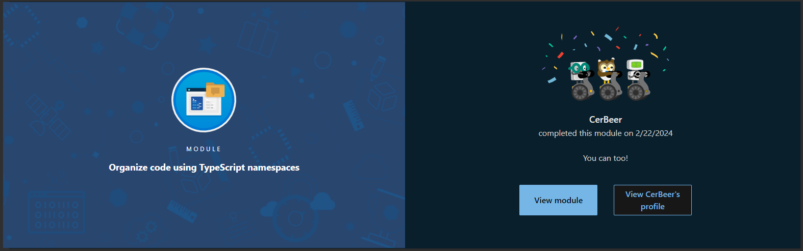

[**Build JavaScript applications using TypeScript**](https://learn.microsoft.com/en-us/users/cerbeer/achievements/blq5p7sd)
  

- [Getting Started with TypeScript: Discover the basics of TypeScript and understand how it enhances JavaScript development.](https://learn.microsoft.com/en-us/users/cerbeer/achievements/n79da78f)
  

- [Declare Variable Types in TypeScript: Learn how to define and use variable types for more robust code.](https://learn.microsoft.com/en-us/users/cerbeer/achievements/9nspjepu)
  

- [Implement Interfaces in TypeScript: Master the use of interfaces to enforce structure on objects and classes.](https://learn.microsoft.com/en-us/users/cerbeer/achievements/hyg5kvg8)
  

- [Develop Typed Functions in TypeScript: Explore how to create and use typed functions for clearer, more predictable code.](https://learn.microsoft.com/en-us/users/cerbeer/achievements/hyglw678)
  

- [Declare and Instantiate Classes in TypeScript: Get hands-on experience with classes, one of the core concepts of TypeScript.](https://learn.microsoft.com/en-us/users/cerbeer/achievements/7enwe7kz)
  

- [Generics in TypeScript: Understand how to use generics for creating reusable and flexible components.](https://learn.microsoft.com/en-us/users/cerbeer/achievements/wachs95n)
  

- [Work with External Libraries in TypeScript: Learn to integrate and utilize external libraries in your TypeScript projects.](https://learn.microsoft.com/en-us/users/cerbeer/achievements/hy6x6338)
  

- [Organize Code with Namespaces in TypeScript: Dive into organizing code effectively using namespaces.](https://learn.microsoft.com/en-us/users/cerbeer/achievements/hy6x9tx8)
  

[back](typescript-essentials)